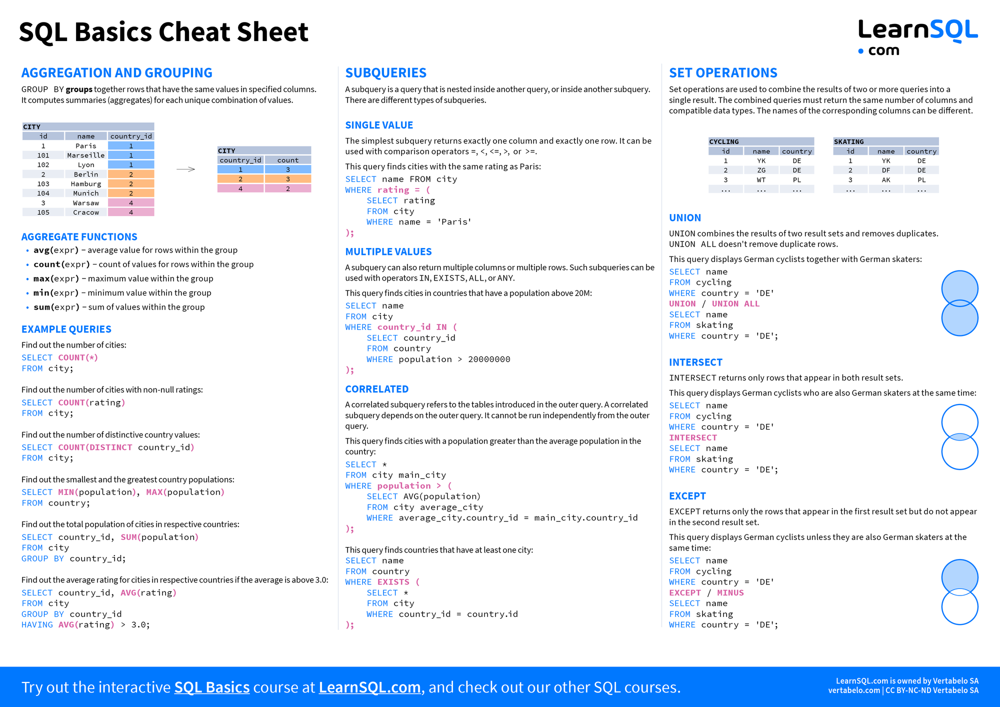

# MySQL

<p>
  Material simples com dicas e comandos MySQL.<br/>
</p>

- Obtendo a data de criação de uma tabela MySQL?
- Encontrar valores dublicados.
- INNER - LEFT - RIGHT - FULL - CROSS JOIN -
    - INNER JOIN: Retorna os registros que tenham correspondência em ambas as tabelas.
    - LEFT JOIN (INCLUSIVO): Retorna todos os registros da tabela à esquerda junto dos registros correspondentes da
      tabela à direita.
    - LEFT JOIN (EXCLUSIVO): Retorna somente os registros da tabela à esquerda que não tiverem correspondência com
      registros da tabela à direita.
    - RIGHT JOIN (INCLUSIVO): Retorna todos os registros da tabela à direita junto dos registros correspondentes da
      tabela à esquerda.
    - RIGHT JOIN (EXCLUSIVO): Retorna somente os registros da tabela à direita que não tiverem correspondência com
      registros da tabela à esquerda.
    - FULL JOIN (INCLUSIVO): Retorna todos os registros quando houver correspondência na tabela à esquerda ou à direita.
    - FULL JOIN (EXCLUSIVO): Retorna todos os registros quando houver correspondência na tabela à esquerda ou à direita,
      porém, não em ambas.
    - CROSS JOIN: Retorna todas as combinações entre os registros da tabela à esquerda e à direita.
- SQL Basics Cheats Sheet 1.
- SQL Basics Cheats Sheet 2.
- TSQL Join Types.

---

**Obtendo a data de criação de uma tabela MySQL?**

```MySQL
show table status where name = 'your-table-name'
```

**Encontrar valores dublicados**

1. Valores dublicados em uma coluna.

```MySQL
SELECT col, COUNT(col)
FROM table_name
GROUP BY col
HAVING COUNT(col) > 1;
```

2. Valores dublicados em multiplas colunas.

````MySQL
SELECT col1,
       COUNT(col1),
       col2,
       COUNT(col2)
FROM table_name
GROUP BY col1,
         col2
HAVING (COUNT(col1) > 1)
   AND (COUNT(col2) > 1)
````

----


**INNER JOIN: Retorna os registros que tenham correspondência em ambas as tabelas**

```MySQL
SELECT *
FROM `POKEMONS`
         INNER JOIN `POKEMON_TIPOS` ON `POKEMONS`.`ID` = `POKEMON_TIPOS`.`POKEMON_ID` 
```

**LEFT JOIN (INCLUSIVO): Retorna todos os registros da tabela à esquerda junto dos registros correspondentes da tabela à
direita**

```MySQL
SELECT *
FROM `POKEMONS`
         LEFT JOIN `POKEMON_TIPOS` ON `POKEMONS`.`ID` = `POKEMON_TIPOS`.`POKEMON_ID` 
```

**LEFT JOIN (EXCLUSIVO): Retorna somente os registros da tabela à esquerda que não tiverem correspondência com registros
da tabela à direita**

```MySQL
SELECT *
FROM `POKEMONS`
         LEFT JOIN `POKEMON_TIPOS` ON `POKEMONS`.`ID` = `POKEMON_TIPOS`.`POKEMON_ID`
WHERE `POKEMON_TIPOS`.`POKEMON_ID` IS NULL
```

**RIGHT JOIN (INCLUSIVO): Retorna todos os registros da tabela à direita junto dos registros correspondentes da tabela à
esquerda**

```MySQL
SELECT *
FROM `POKEMONS`
         RIGHT JOIN
     `POKEMON_TIPOS` ON `POKEMONS`.`ID` = `POKEMON_TIPOS`.`POKEMON_ID`
```

**RIGHT JOIN (EXCLUSIVO): Retorna somente os registros da tabela à direita que não tiverem correspondência com registros
da tabela à esquerda**

```MySQL
SELECT *
FROM `POKEMONS`
         RIGHT JOIN
     `POKEMON_TIPOS` ON `POKEMONS`.`ID` = `POKEMON_TIPOS`.`POKEMON_ID`
WHERE `POKEMONS`.`ID` IS NULL
```

**FULL JOIN (INCLUSIVO): Retorna todos os registros quando houver correspondência na tabela à esquerda ou à direita**

```MySQL
SELECT *
FROM `POKEMONS` FULL
         JOIN
     `POKEMON_TIPOS` ON `POKEMONS`.`ID` = `POKEMON_TIPOS`.`POKEMON_ID` 
```

**FULL JOIN (EXCLUSIVO): Retorna todos os registros quando houver correspondência na tabela à esquerda ou à direita,
porém, não em ambas**

```MySQL
SELECT *
FROM `POKEMONS` FULL
         JOIN `POKEMON_TIPOS` ON `POKEMONS`.`ID` = `POKEMON_TIPOS`.`POKEMON_ID`
WHERE `POKEMONS`.`ID` IS NULL
   OR `POKEMON_TIPOS`.`POKEMON_ID` IS NULL
```

**CROSS JOIN: Retorna todas as combinações entre os registros da tabela à esquerda e à direita**

```MySQL
-- TODAS AS COMBINAÇÕES POSSÍVEIS
SELECT J1.FORMA AS JOGADOR_1,
       J2.FORMA AS JOGADOR_2
FROM `JOKENPO` AS J1
         CROSS JOIN `JOKENPO` AS `J2`;

-- COMBINAÇÕES DE JOGADAS DIFERENTES
SELECT J1.FORMA AS JOGADOR_1,
       J2.FORMA AS JOGADOR_2
FROM `JOKENPO` AS J1
         CROSS JOIN `JOKENPO` AS `J2`
WHERE J1.FORMA <> J2.FORMA
```

A instrução OUTER é opcional, sendo assim os comandos LEFT, RIGHT e FULL podem ser escritos das seguintes formas:

- LEFT JOIN ou LEFT OUTER JOIN
- RIGHT JOIN ou RIGHT OUTER JOIN
- FULL JOIN ou FULL OUTER JOIN

---

### SQL Basics Cheats Sheet 1


----

### SQL Basics Cheats Sheet 2



----

### TSQL Join Types

